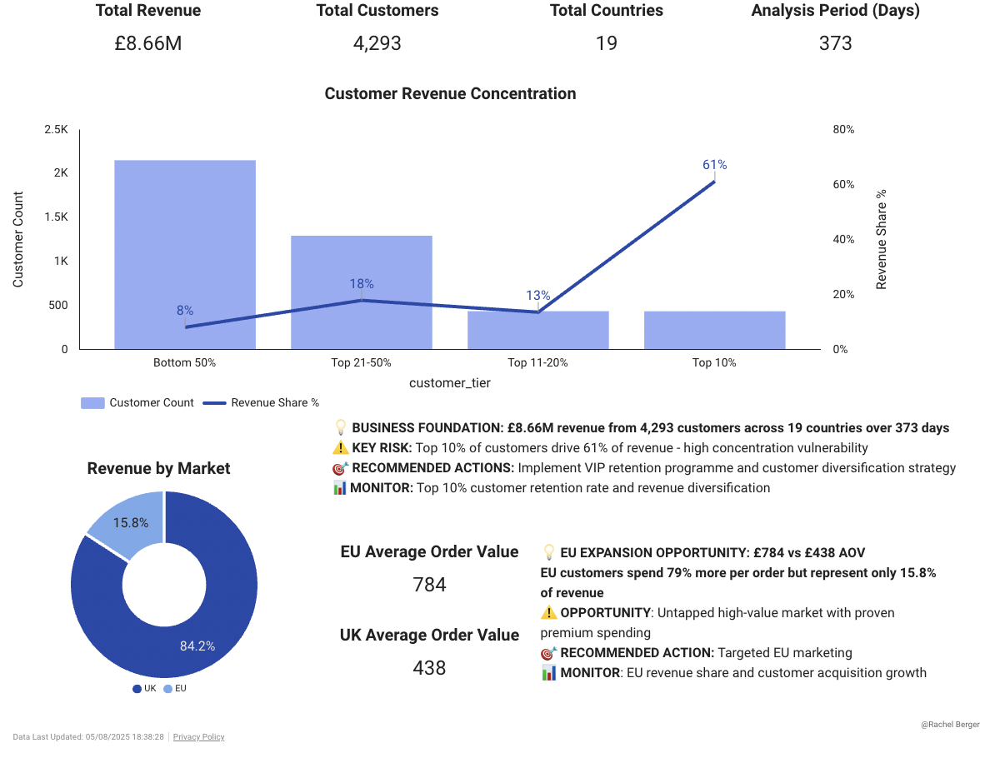
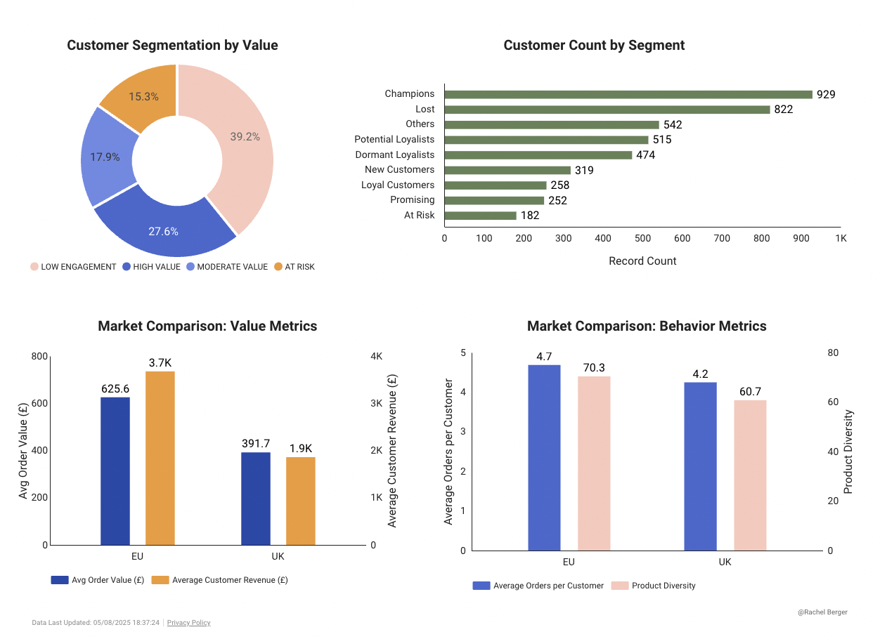
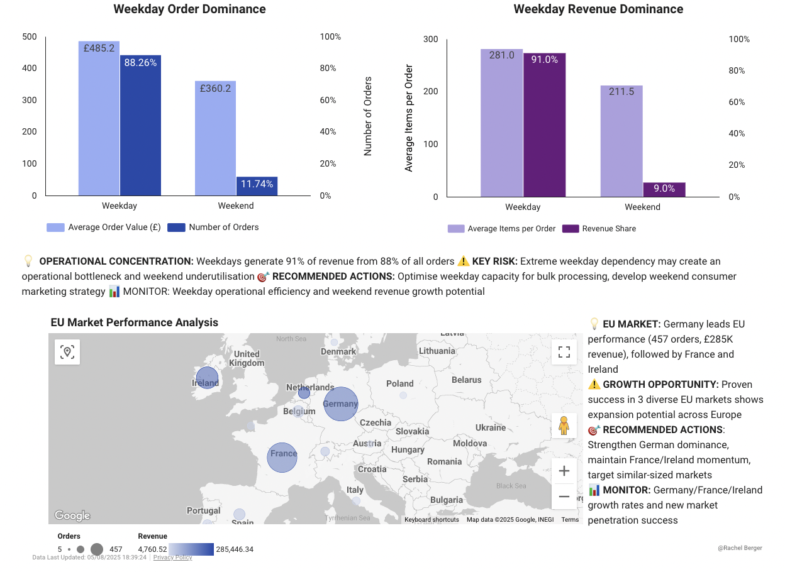
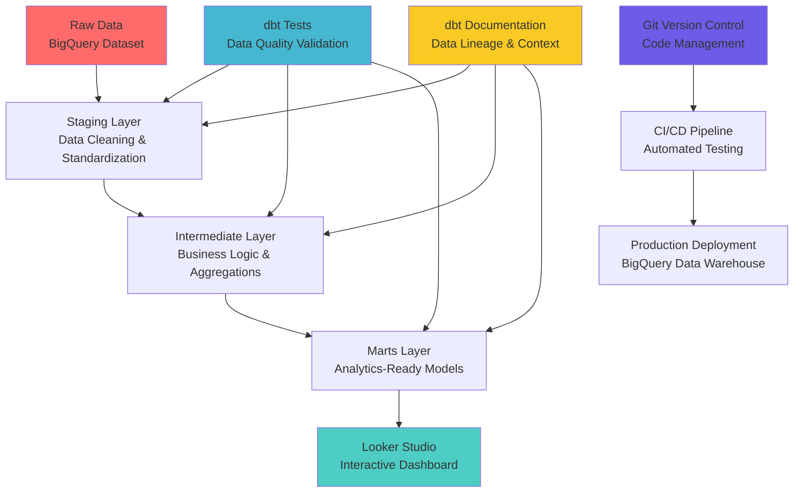

# 🚀 E-Commerce Business Intelligence Platform

**End-to-End Analytics Solution | dbt + BigQuery + Looker Studio**

*Transforming raw transaction data into strategic business intelligence through modern data engineering practices*

## 🎯 Business Problem & Solution

**Problem:** E-commerce companies struggle with fragmented data across multiple systems, making it impossible for executives to get real-time insights into business performance, customer behavior, and revenue trends.

**Solution:** Comprehensive business intelligence platform that transforms raw transactional data into executive-ready dashboards, enabling data-driven decision making for strategic growth.

## 👥 Target Audience

**Primary Users:**
- **E-commerce Executives** - Strategic decision makers needing KPI visibility
- **Marketing Teams** - Customer segmentation and campaign performance analysis  
- **Operations Managers** - Sales performance and inventory insights
- **Data Teams** - Scalable analytics infrastructure and automated reporting

---

## 📊 **Dashboard Story Framework**

### **Page 1: Business Foundation**
**"Where we stand and what drives our business"**

- **Business Scale Context** - £8.66M revenue, 4,293 customers, 19 countries
- **Revenue Concentration Analysis** - Pareto chart revealing 20/60 rule risk
- **Geographic Market Intelligence** - UK volume vs EU value opportunity  
- **Strategic Risk Assessment** - Customer dependency and diversification needs



### **Page 2: Customer Intelligence**  
**"Who our valuable customers are and how they behave"**

- **RFM Segmentation Dashboard** - Champions, Loyal, At-Risk customer analysis
- **Customer Lifecycle Journey** - Retention conversion points and LTV patterns
- **Geographic Behavioral Analysis** - UK frequency vs EU value strategies
- **Actionable Segmentation** - Targeted retention and acquisition opportunities



### **Page 3: Operational Excellence**
**"What sells, when, and where - optimization opportunities"**

- **Product Portfolio Intelligence** - Revenue concentration and inventory optimization
- **Operational Timing Analysis** - Peak patterns and resource allocation insights
- **Geographic Product Performance** - Market-specific product strategies
- **Efficiency Opportunities** - Data-driven operational improvements



---

## 📊 **Live Dashboard**

🔗 **[View Interactive Dashboard](https://lookerstudio.google.com/s/tw-XMlJeoqg)**

**📊 [View Presentation →](https://gamma.app/docs/E-Commerce-Analytics-rikimpbrzfhs9jp)**  
*Complete business case and technical implementation walkthrough*

**Experience the complete analytics story across three strategic domains:**
- **Business Foundation** - Revenue patterns, customer concentration, geographic opportunities
- **Customer Intelligence** - RFM segmentation, lifecycle analysis, behavioral insights  
- **Operational Excellence** - Product portfolio optimization, timing intelligence, geographic performance

---

## 🔍 **Key Business Insights Generated**

### **Customer Intelligence**
- **Revenue Concentration Risk**: Heavy dependence on top customers creates vulnerability - diversification strategy needed to reduce business risk
- **Customer Lifecycle Challenge**: Large "Lost" customer segment indicates retention issues - opportunity for re-engagement campaigns
- **Value Segmentation Opportunity**: Clear high-value customer identification enables targeted premium service and loyalty programs

### **Geographic Strategy**
- **EU Premium Market Potential**: European customers demonstrate willingness to pay premium prices - opportunity for premium product positioning
- **Untapped Revenue Growth**: EU market is significantly underutilized despite proven high-value behavior - expansion strategy required
- **Market-Specific Strategies**: Different purchasing behaviors between regions suggest need for tailored marketing and product approaches

### **Operational Intelligence**
- **Weekend Underutilization**: Lower weekend performance represents missed revenue opportunity - weekend-specific promotions needed
- **Operational Efficiency Gap**: Extreme weekday concentration may create capacity constraints and service quality issues
- **EU Market Leadership**: German market success provides blueprint for expanding into similar European markets

---

## 📈 **Business Impact & Key Achievements**

- **£8.66M** in revenue analyzed across **373 days** of operations
- **4,293 customers** segmented across **19 countries** with **4,000+ products**
- **100% test coverage** with **103/103 passing tests** for enterprise-grade data quality
- **Three-layer data architecture** with comprehensive documentation and lineage

### **Strategic Insights Delivered**
- 🚨 **Customer Concentration Risk**: Top 10% customers drive 61% of revenue
- 🌍 **Geographic Expansion Opportunity**: EU customers demonstrate 79% higher AOV  
- ⏰ **Operational Intelligence**: 91% revenue concentration on weekdays
- 📈 **Product Portfolio Efficiency**: 80% revenue from 30% of products

---

## 🏗️ **Data Architecture & Technical Implementation**

## 📋 **Data Models Architecture**



### **Staging Layer** (`models/staging/`)
- **`stg_invoices`** - Cleaned and standardized transaction data with data quality filters

### **Intermediate Layer** (`models/intermediate/`)
- **`int_customer_metrics`** - Customer-level aggregations and behavioral analysis
- **`int_product_metrics`** - Product performance metrics and portfolio analysis
- **`int_order_items`** - Enriched transaction line items with business classifications
- **`int_rfm_analysis`** - RFM scoring and customer segmentation logic

### **Marts Layer** (`models/marts/`)

#### **Core Models**
- **`fct_sales`** - Primary fact table with daily incremental refresh
- **`dim_customers`** - Customer dimension with RFM segmentation

#### **Analytics Models**  
- **`customer_insights`** - Customer concentration analysis and revenue distribution
- **`product_intelligence`** - Product portfolio optimization and geographic performance
- **`business_overview`** - Executive-level KPIs and business metrics

---

### **Technology Stack**

| Layer | Technology | Purpose |
|-------|------------|---------|
| **Data Warehouse** | Google BigQuery | Scalable cloud data storage and compute |
| **Transformation** | dbt (Data Build Tool) | SQL-based ELT transformations with testing |
| **Visualization** | Looker Studio | Interactive dashboards and self-service BI |
| **Version Control** | Git/GitHub | Code versioning and collaboration |
| **Documentation** | dbt Docs | Automated data lineage and model documentation |
| **Testing** | dbt Tests + Custom SQL | Comprehensive data quality validation |

---

## 🧪 **Data Quality & Testing Framework**

**Enterprise-Grade Quality Assurance: 103/103 Tests Passing (100%)**

### **Test Coverage Strategy**
- **Source Tests** - Raw data validation and freshness monitoring
- **Model Tests** - Business logic validation and data integrity  
- **Cross-Model Tests** - Revenue reconciliation and customer consistency
- **Custom Business Tests** - RFM logic validation and data relationship checks

### **Key Quality Metrics**
- ✅ **Data Integrity**: All primary keys unique, foreign keys validated
- ✅ **Business Logic**: RFM segmentation mathematically sound  
- ✅ **Cross-Model Consistency**: Revenue totals reconciled across models
- ✅ **Data Freshness**: Automated monitoring for data pipeline health

```sql
-- Example Custom Business Test: Revenue Reconciliation
SELECT 
  'fct_sales' as source,
  SUM(line_total) as total_revenue
FROM {{ ref('fct_sales') }}
UNION ALL
SELECT 
  'business_overview' as source,
  total_revenue
FROM {{ ref('business_overview') }}
-- Test fails if revenues don't match across models
```

---

## 🛠️ **Advanced Technical Implementation**

### **Advanced dbt Patterns**
- **Incremental Models**: Efficient daily refresh patterns for large datasets
- **Surrogate Keys**: Complex key generation handling edge cases and data quality
- **Macro Usage**: Reusable SQL components for consistent transformations
- **Custom Tests**: Business-specific validation beyond standard dbt tests

### **Data Engineering Best Practices**
- **Layered Architecture**: Clear separation of staging, intermediate, and marts
- **Comprehensive Testing**: 100% test coverage with multiple test types
- **Documentation**: Rich model and column documentation with business context
- **Version Control**: Structured commit history and branching strategy

### **Performance Optimisation**
- **Partitioning**: Date-based partitioning for query performance
- **Clustering**: Strategic clustering by customer_id and product_id
- **Incremental Processing**: Efficient handling of daily data updates
- **Query Optimisation**: Optimized SQL for BigQuery's distributed architecture

---

## 🚀 **Getting Started**

### **Prerequisites**
- Google Cloud Platform account with BigQuery access
- dbt Cloud account or local dbt installation
- Looker Studio access for dashboard creation

### **Setup Instructions**

1. **Clone the repository**
   ```bash
   git clone https://github.com/yourusername/ecommerce-analytics
   cd ecommerce-analytics
   ```

2. **Install dependencies**
   ```bash
   pip install dbt-bigquery
   dbt deps
   ```

3. **Configure BigQuery connection**
   Update `profiles.yml` with your GCP credentials

4. **Run the data pipeline**
   ```bash
   # Execute full pipeline
   dbt run
   
   # Validate data quality  
   dbt test
   
   # Generate documentation
   dbt docs generate && dbt docs serve
   ```

5. **Access outputs**
   - **Data Models**: Available in BigQuery datasets
   - **Documentation**: Local dbt docs server
   - **Dashboard**: [Live Looker Studio dashboard](https://lookerstudio.google.com/s/tw-XMlJeoqg)

---

## 🎯 **Skills Demonstrated**

### **Analytics Engineering**
- ✅ **Data Modeling**: Dimensional modeling with fact and dimension tables
- ✅ **SQL Development**: Advanced SQL with window functions, CTEs, and aggregations
- ✅ **Data Quality**: Comprehensive testing strategy and validation frameworks
- ✅ **Pipeline Development**: End-to-end ELT pipeline with error handling

### **Business Intelligence**
- ✅ **Dashboard Design**: User-focused design with clear narrative structure
- ✅ **Data Visualization**: Effective chart selection and visual hierarchy
- ✅ **Business Analysis**: Insight generation and strategic recommendations
- ✅ **Stakeholder Communication**: Clear presentation of complex analytical findings

### **Technical Skills**
- ✅ **Cloud Platforms**: Google Cloud Platform and BigQuery optimization
- ✅ **Modern Data Stack**: dbt, Looker Studio, Git integration
- ✅ **Version Control**: Git workflow with meaningful commit history
- ✅ **Documentation**: Technical writing and knowledge sharing

### **Business Acumen**
- ✅ **E-Commerce Analytics**: Deep understanding of retail business metrics
- ✅ **Customer Segmentation**: RFM analysis and lifecycle management
- ✅ **Financial Analysis**: Revenue analysis and profitability insights
- ✅ **Strategic Thinking**: Actionable recommendations for business growth

---

## 📚 **Project Documentation**

### **Data Lineage & Dependencies**
- **Automated Documentation**: dbt generates comprehensive data lineage
- **Model Descriptions**: Business context and technical implementation details
- **Column Definitions**: Clear descriptions of all metrics and dimensions
- **Test Documentation**: Explanation of data quality validation rules

### **Code Documentation**
- **SQL Comments**: Detailed explanation of complex business logic
- **README Files**: Setup instructions and architectural decisions
- **Change Log**: Git commit history documenting all improvements
- **Technical Decisions**: Documentation of modeling choices and trade-offs

---

## 🔗 **Links & Resources**

- **📊 [Live Dashboard](https://lookerstudio.google.com/s/tw-XMlJeoqg)** - Interactive business intelligence dashboard
- **📖 dbt Documentation** - Run `dbt docs generate && dbt docs serve` for complete data lineage
- **🔧 [GitHub Repository](https://github.com/bergerache/ecommerce-analytics)** - Full source code with commit history
- **💼 [LinkedIn Profile](https://www.linkedin.com/in/rachel-berger-data/)** - Professional background

---

**Built with ❤️ for data-driven decision making**

*Part of a comprehensive Business Intelligence Portfolio demonstrating end-to-end analytics solutions for data-driven organizations.*